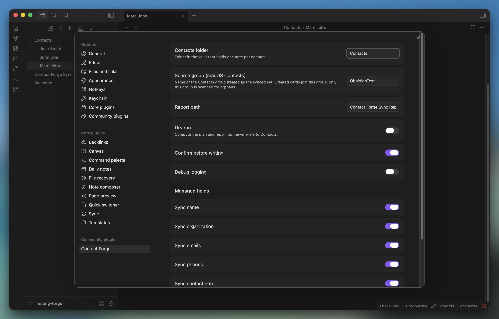
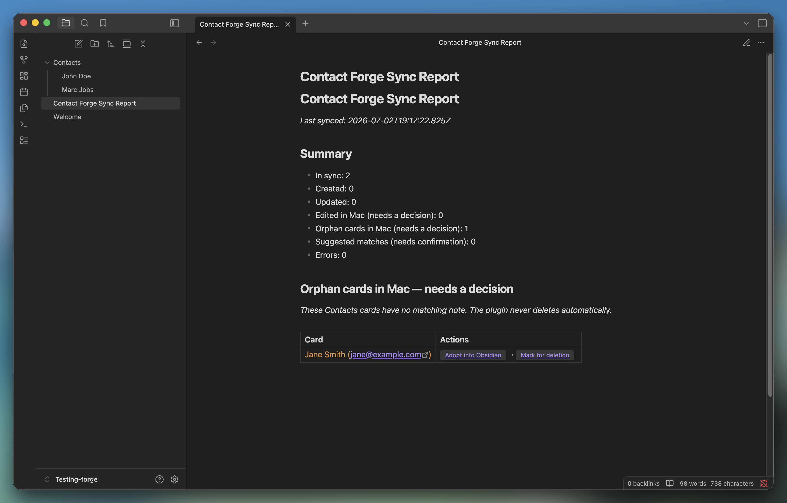
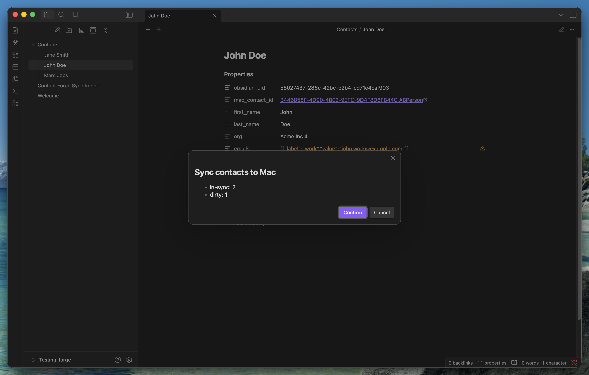
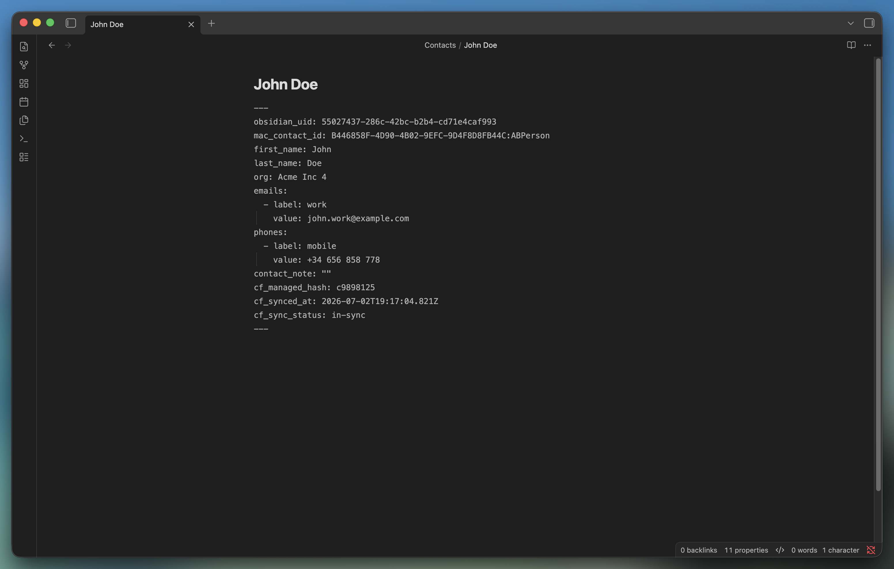

# Contact Forge

> Obsidian is the source of truth for your contacts. Sync a chosen subset **one-way**
> to macOS Contacts, with clear alerts when the two drift out of sync.

**macOS only.** Contact Forge shells out to `osascript` (JXA) to talk to Contacts.app,
so it requires a desktop Obsidian on macOS. Nothing leaves your device.

## Why

Most Obsidian contact tools pull _from_ Apple/Google/iCloud _into_ your vault. Contact
Forge does the opposite: you keep the full record — notes and all — in Obsidian, and
push only the fields needed to identify callers, emails, and messages into a dedicated
Contacts group. iOS benefits automatically via iCloud.

This is a deliberate inversion of [`raulanatol/obsidian-mac-sync-contacts`](https://github.com/raulanatol/obsidian-mac-sync-contacts)
and a plugin-native take on the ideas proven by [`czottmann/obsidian-people`](https://github.com/czottmann/obsidian-people).

## Screenshots

**Settings** — choose the contacts folder, the source Contacts group, and which fields are managed.


**Sync report** — every run's desync alerts, one row per actionable card, with click-through actions.


**Confirm before writing** — a summary modal before anything touches Contacts.app.


**The contact note** — frontmatter holds the managed fields; the body stays freeform.


## How it works

- One markdown note per contact under a configurable folder (default `Contacts/`).
- Frontmatter holds the structured, **managed** fields: name, org, emails, phones, and
  a `contact_note`. The body is freeform and never synced.
- Each note has an immutable `obsidian_uid` (UUID). On sync, the matching Mac card is
  stamped with a `cf-uid:` marker and an `obsidian://` back-link, so matching survives
  renames and Contacts re-indexing.
- A **manual** command reconciles notes against the cards in a chosen Contacts group,
  then pushes changes. Managed fields are push-only: **edits made in Contacts are
  overwritten** (and surfaced first — see below). Photos, groups, and any unmanaged
  field are never touched.

## Sync outcomes

Every run writes a **Sync Report** note. Each contact lands in one bucket:

- **in-sync** — nothing to do.
- **updated** — note changed in Obsidian, pushed to Mac.
- **created** — note had no card yet; a card was created in the source group.
- **edited-in-mac** — the card diverged but the note didn't. Contact Forge does _not_
  silently overwrite; you choose _Overwrite from Obsidian_ or _Pull into Obsidian_.
- **orphan-mac** — a card in the group has no matching note. You choose _Adopt into
  Obsidian_ or _Mark for deletion_ (the plugin never deletes anything itself).
- **suggestion** — a weak name+email match; confirm or ignore.

## Safety

- **Dry run** and **confirm-before-write** are available (recommend trying dry run first).
- The plugin only reads/writes the one Contacts group you configure.
- No network calls, no telemetry. Everything runs locally through `osascript`.

This plugin requests capabilities beyond the typical Obsidian plugin because syncing to
Contacts.app has no alternative on macOS. For transparency:

- **Shell execution** (`child_process`): the only way to talk to Contacts.app is
  `osascript -l JavaScript`. There is no Obsidian or Node API for it.
- **Filesystem access** (`fs`, outside the vault): JXA payloads are written to a
  temp file in `os.tmpdir()` and passed to `osascript` by path, then deleted. This
  avoids the argv length limits and quoting bugs that come with inlining large
  scripts via `osascript -e`. No vault or user file is ever touched through `fs`.
- **Vault enumeration** (`vault.getMarkdownFiles()`): Obsidian has no folder-scoped
  listing API, so the plugin lists all markdown files and filters to the configured
  contacts folder client-side before reading anything.

## Install

Community plugin (pending review) or manual — see [docs/INSTALLATION.md](docs/INSTALLATION.md).

First run: grant **System Settings → Privacy & Security → Automation → Obsidian →
Contacts**. Use the _Test Contacts access_ command to trigger the prompt.

## Commands

- Contact Forge: Sync contacts to Mac
- Contact Forge: Dry-run (report only, no writes)
- Contact Forge: Test Contacts access
- Contact Forge: Bulk adopt all orphan contacts into Obsidian
- Contact Forge: Create contact note from template
- Contact Forge: Open sync report

## Development

```bash
pnpm install
pnpm run dev     # esbuild watch
pnpm test        # pure unit tests (hash + reconciler)
pnpm run build   # typecheck + production bundle
```

The reconciliation engine (`src/sync/Reconciler.ts`) and hashing (`src/core/hash.ts`)
are pure and fully unit-tested. See [docs/BUILD_PLAN.md](docs/BUILD_PLAN.md) for the
full architecture and the phased build plan.

## License

MIT © Raúl Anatol
